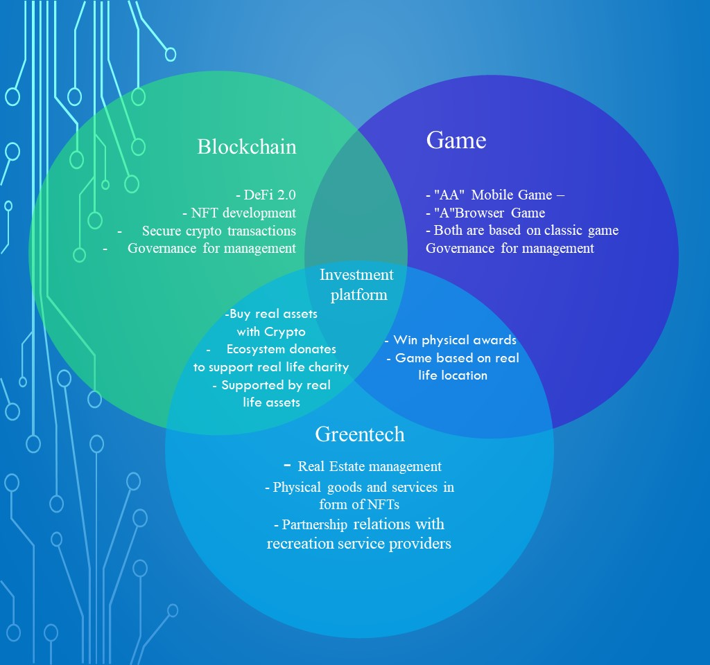

# Planet PROC


PROC Ecosystem whitepaper, v 1.1 - Dec 2023


## Blockchain + Greentech + Web 3.0.&#x20;


Planet PROC  is an ecosystem that connects blockchain, greentech,  and the real world through the integration of technological and financial solutionsanetn&#x20;


We are creating a decentralized platform for the tokenization of the Green Economy. The platform provides simple and highly scalable access to green technologies.&#x20;

The Planet PROC project is aimed at improving the environment and developing the principles of a green economy.

PROCecoverse offers all stakeholders crowdfunding and participation in shaping the decentralized development of the green economy.&#x20;

Ecosystem of a new generation of PROC with the direct participation of any person, using a loyalty program. Its uniqueness lies in the receipt of regular privileges and discount coupons, as well as the establishment of special prices for goods and services.

<figure><figcaption></figcaption></figure>
